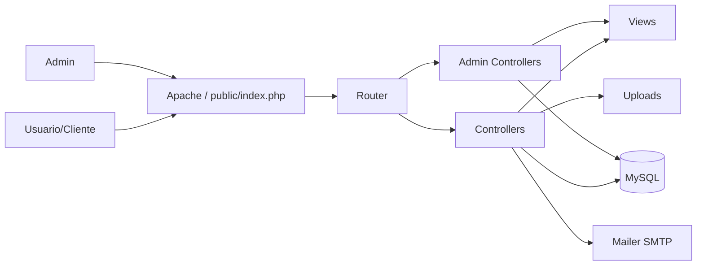
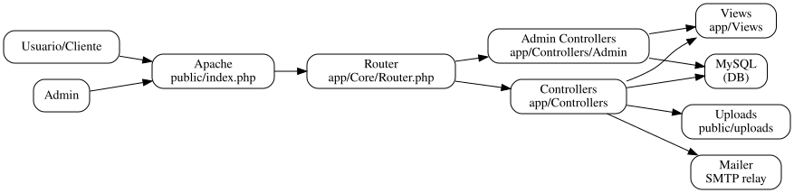
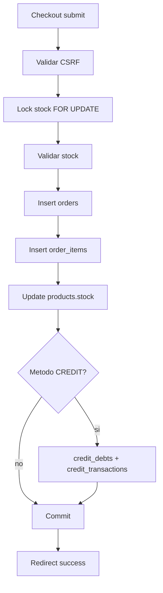
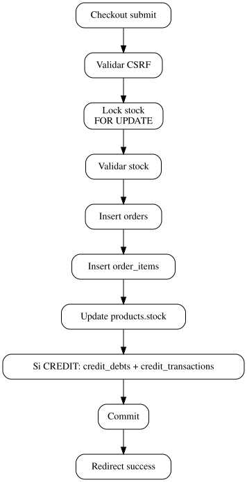
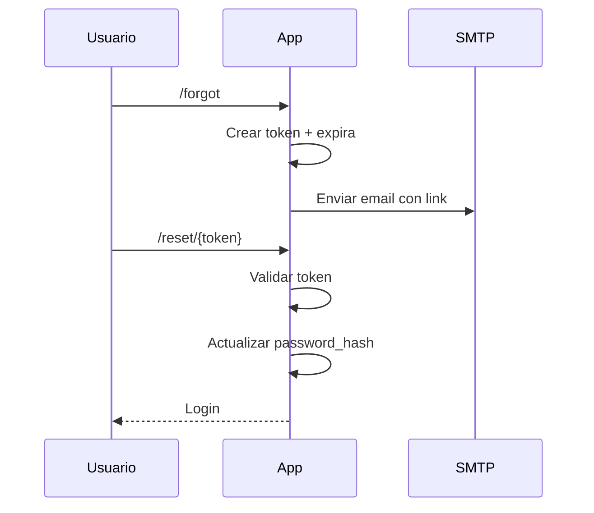
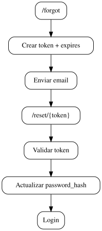
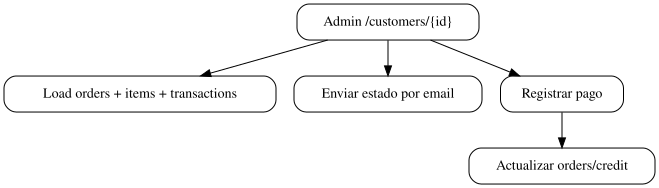

# Tiendita - Documentacion Detallada

## 1. Arquitectura
Aplicacion PHP sin framework con MVC simple. Todo el trafico entra por `public/index.php`.

### 1.1 Flujo general
1. Apache sirve `public/index.php`.
2. Se carga config y helpers.
3. Autoload de clases `App\*`.
4. Router resuelve la ruta y llama al controlador.
5. Controlador prepara datos y renderiza vista.

### 1.2 Router
Archivo: `app/Core/Router.php`
- Registra rutas GET/POST.
- Soporta parametros tipo `/product/{id}`.
- Si no encuentra ruta, responde 404.

### 1.3 Auth
Archivo: `app/Core/Auth.php`
- Maneja session y usuario logueado.
- Genera y valida CSRF.

### 1.4 Helpers
Archivo: `app/Core/helpers.php`
- `asset_url($path)`:
  - Devuelve URL absoluta para assets locales.
  - Acepta URLs HTTP completas.

## 2. Configuracion
Archivo: `app/Config/config.php`

### 2.1 Base URL
- `base_url` se usa para rutas internas.
- `base_url_full` se usa para links en emails.

### 2.2 SMTP
Se usa Mailer interno en `app/Core/Mailer.php`.
- Relay sin TLS (puerto 25).
- AUTH LOGIN con usuario y pass.

## 3. Tienda
### 3.1 Home
`StoreController::home()` lista productos activos con categoria.

### 3.2 Producto
`StoreController::show()` carga detalle y genera CSRF para agregar al carrito.

### 3.3 Carrito
`CartController` usa `$_SESSION['cart']`.
- Agrega, actualiza, elimina.
- Valida stock real en DB.

## 4. Checkout
Archivo: `CheckoutController::submitOrder()`

### 4.1 Validaciones
- Usuario logueado.
- CSRF valido.
- Stock disponible.

### 4.2 Inventario y transaccion
- Se bloquean productos con `FOR UPDATE`.
- Se inserta `orders`.
- Se insertan `order_items`.
- Se descuenta stock.

### 4.3 Metodos de pago
- `cash` -> `CASH` (pagado).
- `credit` -> `CREDIT` (pendiente).
- `yappi` -> `TRANSFER` (pagado).

### 4.4 Comprobante
- Guardado en `public/uploads/receipts`.
- Ruta en `orders.receipt_path`.

## 5. Admin
### 5.1 Dashboard
Controlador: `AdminDashboardController`.
Muestra:
- Deuda total
- Pagos totales
- Ticket promedio
- Clientes
- Graficas con Chart.js

### 5.2 Productos
Controlador: `AdminProductsController`.
- CRUD completo.
- Upload de imagen o URL.

### 5.3 Clientes
Controlador: `AdminCustomersController`.
- Lista usuarios (clientes y admins).
- Estado de cuenta con filtros.
- Enviar resumen por email.
- Exportar CSV/PDF.

### 5.4 Pagos
En estado de cuenta:
- Se pueden registrar pagos manuales.
- Se actualiza `orders.amount_paid` y `payment_status`.
- Se registra en `credit_transactions`.

## 6. Recuperacion de contrasena
Tabla: `password_resets`.

Flujo:
1. `/forgot` crea token y lo envia por email.
2. `/reset/{token}` valida token.
3. Actualiza `users.password_hash`.

## 7. Reportes
- CSV y PDF desde admin.
- PDF es simple, texto plano.

## 8. Seguridad
- CSRF en formularios importantes.
- Passwords con bcrypt.
- Validacion basica de inputs.

## 9. Operaciones y mantenimiento
- Ver logs en `/var/log/apache2/error.log`.
- Ver archivos subidos en `public/uploads`.
- Revisar permisos de `public/uploads` (www-data).

## 10. Usuarios administradores
Actualmente activos:
- `pruebas1@dcsolution.net`
- `emonique4@hotmail.com`
- `info@dcsolution.net`


## 11. Diagramas

### 11.1 Arquitectura




### 11.2 Checkout




### 11.3 Recuperacion de contrasena




### 11.4 Estado de cuenta (Admin)
```mermaid
flowchart TD
  A[Admin /customers/{id}] --> L[Load orders/items/transactions]
  A --> E[Enviar estado por email]
  A --> P[Registrar pago]
  P --> U[Actualizar orders/credit]
```


